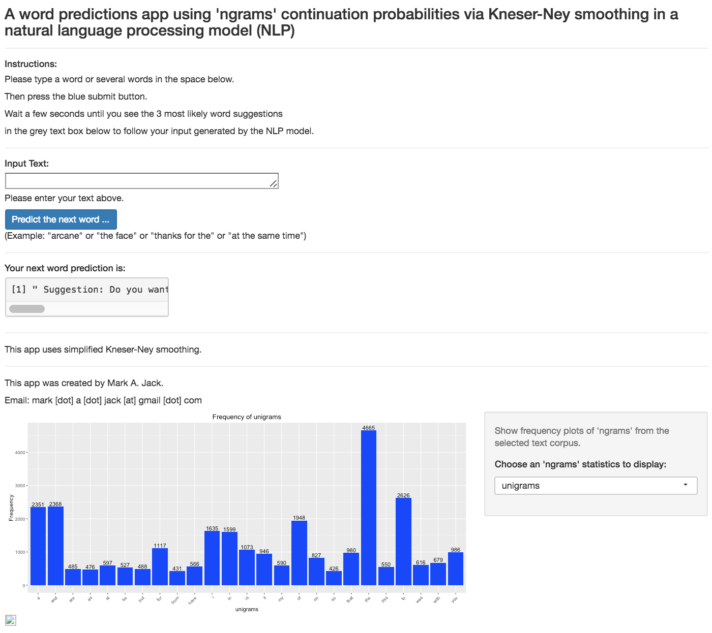

# Capstone Project in the Coursera 'Data Science Specialization' (Johns Hopkins University)
---
title: "CapstoneProject.Rmd"
author: "Mark A. Jack"
date: "Nov. 24, 2016"
output: html_document
---

## Executive Summary
This report provides an initial exploratory analysis of the three data files provided for the NLP capstone project. Several libraries are uploaded. The creation of a corpus of documents from the three text data files mostly relies on the use of the libary 'quanteda'. It allows to quickly tokenize the corpus of documents to remove text features such as punctuation, numbers, white space, lowercase words etc. The processing time for the complete text data is considerable. Thus, a corpus is only created for a sample of the documents. Unigrams, bigrams, trigrams and quadgrams are generated via 'quanteda's' format of a document-frequency matrix (dfm). A dfm allows for quick and easy analysis of the most frequent occurring ngrams.
## Environment
```{r, include=FALSE}
library(R.utils)
library(stringr)
library(knitr)
library(devtools)
library(quanteda)
library(slam)
#
library(tm)
library(NLP)
library(openNLP)
library(qdap)
library(RWeka)
library(ngram)
library(SnowballC)
#
library(ggplot2)
library(plyr)
library(dplyr)
```

## Load and Prepare Data for Tokenization
The blogs, news and twitter data files are uploaded via the call 'readLines' (en_US.blogs.txt, en_US.news.txt, n_US.twitter.txt) and the number of lines in each text file are counted.
```{r, echo=FALSE}
blogs <- readLines(file("en_US.blogs.txt",encoding = "UTF-8"),encoding = "UTF-8", skipNul=TRUE)
news <- readLines(file("en_US.news.txt",encoding = "UTF-8"),encoding = "UTF-8", skipNul=TRUE)
twitter <- readLines(file("en_US.twitter.txt",encoding = "UTF-8"),encoding = "UTF-8", skipNul=TRUE)
close(file("en_US.twitter.txt")) 
close(file("en_US.news.txt")) 
close(file("en_US.blogs.txt")) 
#
# Number of lines in each data file:
nl_blogs <- length(blogs)
nl_blogs
nl_news <- length(news)
nl_news
nl_twitter <- length(twitter)
nl_twitter
```

We then collapse each text to a stream of characters to count the number of characters in each data file after removing white space " " and defining individual words and lines of text:
```{r, echo=FALSE}
nchar(paste(blogs, collapse = " "))
nchar(paste(news, collapse = " "))
nchar(paste(twitter, collapse = " "))
```

## Tokenization of the Data
A corpus is created from samples of each of the three text documents blogs, news and twitter. For quick processing, a small sample size of 1% of the original document size is selected. A key R library to accelerate the generation and handling of the 'corpus' from a group of text documents is the tool 'quanteda' which is being used here. 
```{r, echo=TRUE}
# Create one corpus of text using the library 'quanteda'
require(quanteda)
sampleSize <- 0.01
set.seed(1234)
blogs.sample <- sample(blogs, nl_blogs*sampleSize)
news.sample <- sample(news, nl_news*sampleSize)
twitter.sample <- sample(twitter, nl_twitter*sampleSize)
doc.sample <- c(blogs.sample, news.sample, twitter.sample)
#
doc.sample <- gsub("^", " ", doc.sample)
doc.sample <- gsub("$", " ", doc.sample)
#doc.sample  <- gsub("[;,\\.\\_\\?\\!\\“\\”]", " ", doc.sample)
doc.corpus <- corpus(doc.sample)
```

The object sizes [in bytes] are printed to see the change in object size for the blogs data, the sample taken from the blogs file, the complete sample created from the blogs, bnews and twitter samples and finally the change in file size when creating a corpus from the sample file:
```{r, echo=FALSE}
# Check object sizes [in bytes] and print an example and a summary of the corpus of documents:
objectSize(blogs)
objectSize(blogs.sample)
objectSize(doc.sample)
objectSize(doc.corpus)
```

A summary of the corpus of documents is available here:
```{r, echo=FALSE}
#head(doc.corpus, 5)
summary(doc.corpus, 5)
```

The corpus is tokenized: Text is transformed by removing profanity, creating lowercase words, removing numbers, punctuations, hyphens, separators, twitter symbols, and stemming of words. A list of words of profanity is downloaded from the website: 
http://www.frontgatemedia.com/a-list-of-723-bad-words-to-blacklist-and-how-to-use-facebooks-moderation-tool. Stopwords (in English) (e.g. terms like 'I'm', 'won't', 'Harry's') are kept in the text corpus to prevent a skewing of calculated probabilities for word combinations (ngrams) by artefacts created such as single letters like "s" or "t", and to stay close to how a human user would typically type in words on the commamd line in a word prediction algorithm. In the same breadth, unigrams, bigrams and trigrams are generated using 'quanteda's' feature 'dfm', a document frequency matrix.  
```{r, echo=TRUE}
# Download list of words of profanity from Website 
# http://www.frontgatemedia.com/a-list-of-723-bad-words-to-blacklist-and-how-to-use-facebooks-moderation-tool/
profanity <- readLines(file("Terms-to-Block.csv",encoding = "UTF-8"),encoding = "UTF-8")
close(file("Terms-to-Block.csv"))
#
# Tokenization: Create corpus of unigrams, bigrams, trigrams
#doc.tokens <- tokenize(toLower(doc.corpus), removePunct = TRUE, removeNumbers = TRUE, 
#              removeTwitter = TRUE, removeSeparators = TRUE, removeHyphens = TRUE)
#doc.nosw <- removeFeatures(doc.tokens, stopwords("english"))
#
unigrams.dfm  <- dfm(doc.corpus, ngrams = 1, ignoredFeatures = c(profanity), 
                     toLower = TRUE, removePunct = TRUE, removeNumbers = TRUE, concatenator = " ",
                     removeTwitter = TRUE, removeSeparators = TRUE, removeHyphens = TRUE, stem = FALSE)
#
bigrams.dfm   <- dfm(doc.corpus, ngrams = 2, ignoredFeatures = c(profanity), 
                     toLower = TRUE, removePunct = TRUE, removeNumbers = TRUE, concatenator = " ",
                     removeTwitter = TRUE, removeSeparators = TRUE, removeHyphens = TRUE, stem = FALSE)
#
trigrams.dfm  <- dfm(doc.corpus, ngrams = 3, ignoredFeatures = c(profanity), 
                     toLower = TRUE, removePunct = TRUE, removeNumbers = TRUE, concatenator = " ",
                     removeTwitter = TRUE, removeSeparators = TRUE, removeHyphens = TRUE, stem = FALSE)
#
quadgrams.dfm <- dfm(doc.corpus, ngrams = 4, ignoredFeatures = c(profanity),
                     toLower = TRUE, removePunct = TRUE, removeNumbers = TRUE, concatenator = " ",
                     removeTwitter = TRUE, removeSeparators = TRUE, removeHyphens = TRUE, stem = FALSE)
#
objectSize(unigrams.dfm)
objectSize(bigrams.dfm)
objectSize(trigrams.dfm)
objectSize(quadgrams.dfm)
```

## Exploratory Data Analysis
With the 'topfeatures' call in each of the unigrams, bigrams and trigrams dfms, we obtain the 25 most frequent features in each of the sets of ngrams. In three bar plots, we show the number of occurances of each of the most common words or 2- or 3- or 4-word combinations (unigrams, bigrams, trigrams, quadgrams) as horizontal bars. 

```{r, echo=FALSE}
# Create bar plots of 25 most frequent features in unigrams, bigrams, trigrams, quadgrams:
unigrams.df <- readRDS(file="unigram_model.Rds")
bigrams.df <- readRDS(file="bigram_model.Rds")
trigrams.df <- readRDS(file="trigram_model.Rds")
quadgrams.df <- readRDS(file="quadgram_model.Rds")
#
#unigrams.dfm <- readRDS(file="unigrams_dfm.Rds")
#bigrams.dfm <- readRDS(file="bigrams_dfm.Rds")
#trigrams.dfm <- readRDS(file="trigrams_dfm.Rds")
#quadgrams.dfm <- readRDS(file="quadgrams_dfm.Rds")
#
par(mar=c(4,4,2,2))
par(mfrow = c(1,1))
barplot(topfeatures(unigrams.dfm, 25), horiz=TRUE, las=1, col="Blue")
#dev.copy(png, file = "barplot_uni.png")
#dev.off()
#
par(mar=c(4,6,2,2))
par(mfrow = c(1,1))
barplot(topfeatures(bigrams.dfm, 25), horiz=TRUE, las=1, col="Green")
#dev.copy(png, file = "barplot_bi.png")
#dev.off()
#
par(mar=c(4,8,2,2))
par(mfrow = c(1,1))
barplot(topfeatures(trigrams.dfm, 25), horiz=TRUE, las=1, col="Red")
#dev.copy(png, file = "barplot_tri.png")
#dev.off()
#
par(mar=c(4,10,2,2))
par(mfrow = c(1,1))
barplot(topfeatures(quadgrams.dfm, 25), horiz=TRUE, las=1, col="Purple")
#dev.copy(png, file = "barplot_quad.png")
#dev.off()
#
```

We may further process unigrams, bigrams, trigrams and quadgrams by removing infrequent data, e.g. data that occurs less than twice:
```{r, echo=TRUE}
head(unigrams.dfm, 3)
head(bigrams.dfm, 3)
head(trigrams.dfm, 3)
head(quadgrams.dfm, 3)
#
unigrams.freq0 <- colSums(unigrams.dfm)
unigrams.freq <- sort(unigrams.freq0, decreasing=TRUE) 
#
bigrams.freq0 <- colSums(bigrams.dfm)
bigrams.freq <- sort(bigrams.freq0, decreasing=TRUE) 
#
trigrams.freq0 <- colSums(trigrams.dfm)
trigrams.freq <- sort(trigrams.freq0, decreasing=TRUE) 
#
quadgrams.freq0 <- colSums(quadgrams.dfm)
quadgrams.freq <- sort(quadgrams.freq0, decreasing=TRUE) 
#
#-------------------------------------------------------------------------
frequency <- 2
#
unigrams.most <- as.numeric()
for (i in 1:length(unigrams.freq)) { 
  if (unigrams.freq[i] > frequency) {
    unigrams.most  <- c(unigrams.most, unigrams.freq[i]) }
}
length(unigrams.most)
#
bigrams.most <- as.numeric()
for (i in 1:length(bigrams.freq)) { 
  if (bigrams.freq[i] > frequency) {
    bigrams.most  <- c(bigrams.most, bigrams.freq[i]) }
}
length(bigrams.most)
#
trigrams.most <- as.numeric()
for (i in 1:length(trigrams.freq)) { 
  if (trigrams.freq[i] > frequency) {
    trigrams.most  <- c(trigrams.most, trigrams.freq[i]) }
}
length(trigrams.most)
#
quadgrams.most <- as.numeric()
for (i in 1:length(quadgrams.freq)) { 
  if (quadgrams.freq[i] > frequency) {
    quadgrams.most  <- c(quadgrams.most, quadgrams.freq[i]) }
}
length(quadgrams.most)
```

We then create data frames and select the 25 most frequent occurances in sorted lists of unigrams, bigrams, trigrams and quadgrams and label the columns:
```{r, echo=TRUE}
unigrams_most <- data.frame(unigrams.most)
unigrams_most[, 1] <- as.character(names(unigrams.most))
unigrams_most[, 2] <- as.numeric(unigrams.most)
unigrams_most0 <- unigrams_most[1:25,]
colnames(unigrams_most0) <- c("Word","Frequency")
row.names(unigrams_most0) <- NULL
head(unigrams_most0)
#
bigrams_most <- data.frame(bigrams.most)
bigrams_most[, 1] <- as.character(names(bigrams.most))
bigrams_most[, 2] <- as.numeric(bigrams.most)
bigrams_most0 <- bigrams_most[1:25,]
colnames(bigrams_most0) <- c("Word","Frequency")
row.names(bigrams_most0) <- NULL
head(bigrams_most0)
#
trigrams_most <- data.frame(trigrams.most)
trigrams_most[, 1] <- as.character(names(trigrams.most))
trigrams_most[, 2] <- as.numeric(trigrams.most)
trigrams_most0 <- trigrams_most[1:25,]
colnames(trigrams_most0) <- c("Word","Frequency")
row.names(trigrams_most0) <- NULL
head(trigrams_most0)
#
quadgrams_most <- data.frame(quadgrams.most)
quadgrams_most[, 1] <- as.character(names(quadgrams.most))
quadgrams_most[, 2] <- as.numeric(quadgrams.most)
quadgrams_most0 <- quadgrams_most[1:25,]
colnames(quadgrams_most0) <- c("Word","Frequency")
row.names(quadgrams_most0) <- NULL
head(quadgrams_most0)
```

We have created histograms of the unigram, bigram, trigram, and quadgram occurrances from the selected text corpus:

```{r, echo = FALSE}
# Plots of histograms of unigram, bigram, trigram, quadgram occurrances:
g1 <- ggplot(data = unigrams_most0, aes(x=Word,y=Frequency)) + geom_bar(stat="Identity", fill="Blue") 
g2 <- g1 + geom_text(aes(label=Frequency), vjust=-0.20) + labs(title = "Frequency of unigrams") 
g3 <- g2 + labs(x = "Unigrams", y = "Frequency")
g4 <- g3 + theme(axis.text.x = element_text(angle = 45, hjust = 1))
g4
#dev.copy(png, file = "unigrams_freq.png")
#dev.off()

g1 <- ggplot(data = bigrams_most0, aes(x=Word,y=Frequency)) + geom_bar(stat="Identity", fill="Green") 
g2 <- g1 + geom_text(aes(label=Frequency), vjust=-0.20) + labs(title = "Frequency of bigrams") 
g3 <- g2 + labs(x = "Bigrams", y = "Frequency")
g4 <- g3 + theme(axis.text.x = element_text(angle = 45, hjust = 1))
g4
#dev.copy(png, file = "bigrams_freq.png")
#dev.off()

g1 <- ggplot(data = trigrams_most0, aes(x=Word,y=Frequency)) + geom_bar(stat="Identity", fill="Red") 
g2 <- g1 + geom_text(aes(label=Frequency), vjust=-0.20) + labs(title = "Frequency of trigrams") 
g3 <- g2 + labs(x = "Trigrams", y = "Frequency")
g4 <- g3 + theme(axis.text.x = element_text(angle = 45, hjust = 1))
g4
#dev.copy(png, file = "trigrams_freq.png")
#dev.off()

g1 <- ggplot(data = quadgrams_most0, aes(x=Word,y=Frequency)) + geom_bar(stat="Identity", fill="Purple") 
g2 <- g1 + geom_text(aes(label=Frequency), vjust=-0.20) + labs(title = "Frequency of quadgrams") 
g3 <- g2 + labs(x = "Quadgrams", y = "Frequency")
g4 <- g3 + theme(axis.text.x = element_text(angle = 45, hjust = 1))
g4
#dev.copy(png, file = "quadgrams_freq.png")
#dev.off()
```

As further illustration, here is a so-called 'word cloud' plot for the 'quadgram' statistics:
```{r, echo = FALSE}
# Create a word cloud plot:
suppressWarnings(
if (require(RColorBrewer))
 plot(quadgrams.dfm, max.words = 200, colors = brewer.pal(6, "Dark2"), scale = c(8, .5))
 #dev.copy(png, file = "quadgrams_cloud.png")
 #dev.off()
)
```

Finally, this is a snapshot of the final interactive 'shiny app' application - a word prediction application that uses the 'Kneser-Ney smoothing' formalism with calculated continuation probabilities from the individual ngram occurrences in the selected text corpus and estimating probabilities for rare ngrams that did not appear in the corpus. The app provides up to the three most likely word suggestions to continue a typed sentence that is submitted by the user.

<div align="center">

</div>